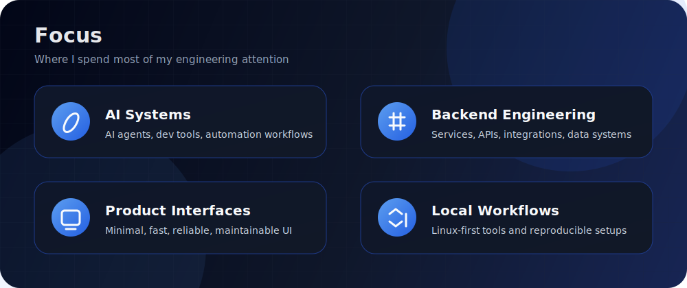

  

  
  
  

<h3 align="center">I build practical software, AI tools, backend systems, and automation that survives real usage.</h3>

---

## Focus

  

## Technical Stack

### Languages

  

Python · TypeScript · JavaScript · Go · C++ · Shell/Bash · Ruby · HTML · CSS · TeX/LaTeX · SQL/PLpgSQL · Markdown/MDX

### Backend

  

FastAPI · Uvicorn · Pydantic · SQLAlchemy · Alembic · asyncpg · PostgreSQL · SQLite · REST APIs · WebSockets · HTTPX · Requests · aiohttp

### Frontend

  

React · Vite · TypeScript · Tailwind CSS · Astro · Three.js / React Three Fiber · Motion · GSAP · xterm.js · Responsive UI

### AI, ML, And Data

  

OpenAI SDK · Anthropic SDK · MCP · AI agents · tool calling · prompt/tool workflows · faster-whisper · Whisper-style transcription · Transformers · PyTorch · Hugging Face · NumPy · Pandas · Jupyter Notebook · Computer Vision · Kaggle workflows

### DevOps And Tooling

  

Docker · Docker Compose · Linux · Git · GitHub Actions · Nix · PowerShell · uv · Ruff · Pytest · ESLint · pnpm/npm · Makefile · CLI tooling

### Integrations

Telegram Bot API · Discord · Slack · Matrix · Feishu/Lark · DingTalk · WeCom · Google Workspace APIs · YouTube APIs · Browser automation · Voice/TTS/STT integrations

## GitHub Metrics

  

  
  

